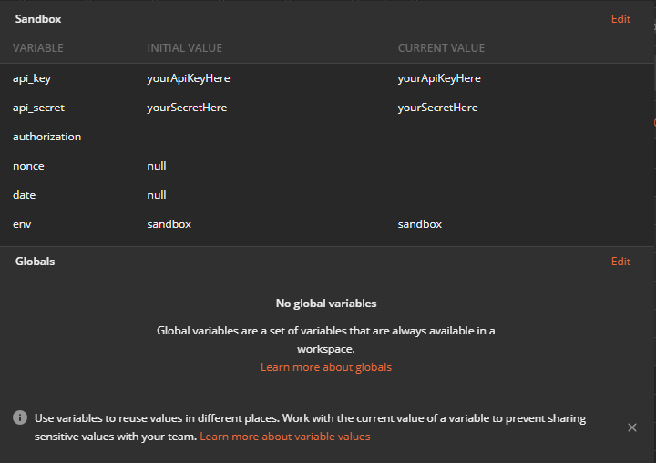
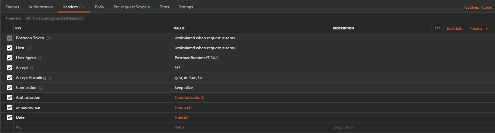

# Modulr Finance HMAC

## Authentication process

An in-depth documentation of the whole authentication process can be found at [Authentication](https://modulr.readme.io/docs/authentication)

## Samples

Please note the samples are designed to be self contained to demonstrate hmac signature usage.

Samples directory contain sample code for the following languages:

- [Java](#java)
- [Scala](#scala)
- [Kotlin](#kotlin)
- [NodeJS](#nodejs)
- [Postman](#postman-pre-request-script)
- [Python](#python)
- [Ruby](#ruby)
- [C](#c)
- [C++](#cpp)
- [C\#](#c-2)
- [Golang](#golang)
---

### Java

#### [com.modulr.api.ModulrApiAuth.java](samples/java/src/main/java/com/modulr/api/ModulrApiAuth.java)

This class is a helper that can generate required headers for a given value of API key and secret. It generates the following headers:

- Authorization
- Date
- x-mod-nonce
- x-mod-retry

To use this class instantiate it using your API key and secret.

```java
    ModulrApiAuth modulrAuth = new ModulrApiAuth("KNOWN-TOKEN", "SECRET-TOKEN");
```
``
Then use one of the generateXXX methods to get a map of headers with the header name as the key.

```java
    Map<String, String> headers = modulrAuth.generateApiAuthHeaders("NONCE"); // replace NONCE with correct nonce to be used

    headers.forEach((key, value) -> System.out.println(key + ": " + value));
```

OR

```java
    Map<String, String> headers = modulrAuth.generateRetryApiAuthHeaders(); // reuses the nonce used on the last generateApiAuthHeaders call

    headers.forEach((key, value) -> System.out.println(key + ": " + value));
```

#### [com.modulr.hmac.Hmac.java](samples/java/src/main/java/com/modulr/hmac/Hmac.java)

This class demonstrates how to use the ModulrApiAuth class.

---

### Scala

#### [Signature.scala](samples/scala/src/main/scala/Signature.scala)

This class is a helper that can generate required headers for a given value of API key and secret. It generates the following headers:

- Authorization
- Date
- x-mod-nonce

You can start by creating an instance of Signature class
```scala
  val signature: Signature = new Signature("key", "secret")
```
Then you can get your Auth headers by simply calling `.buildHeaders()`. In that case a nonce will be a random UUID and Date will default to current
```scala
  val headersDefault: Map[String, String] = signature.buildHeaders() 
```
OR with custom nonce
```scala
  val headersCustomNonce: Map[String, String] = signature.buildHeaders("nonceValue")
```
OR with both custom nonce and custom date 
```scala
  val headersCustomAll: Map[String, String] = signature.buildHeaders("nonceValue", Calendar.getInstance().getTime)
```

You can see all of it in action in [Main.scala](samples/scala/src/main/scala/Main.scala) class example

---

### Kotlin

#### [com.modulr.api.Signature.kt](samples/kotlin/src/main/kotlin/com/modulr/api/Signature.kt)

This class is a helper that can generate required headers for a given value of API key and secret. It generates the following headers:

- Authorization
- Date
- x-mod-nonce

To use this class instantiate it using your API key and secret.

```kotlin
    val signature = Singature(API_KEY, API_SECRET)
```

Then use the calculate() to get generated headers.

```kotlin
    val result = signature.calculate()
    val headers = result.headers
```

OR with a specific nonce and date

```kotlin
    val date = Date.from(ZonedDateTime.of(LocalDateTime.parse("2016-07-25T16:36:07"), ZoneId.of("Z")).toInstant())

    val result = signature.calculate("28154b2-9c62b93cc22a-24c9e2-5536d7d", date)
    val headers = result.headers
```

#### [com.modulr.api.Example.kt](samples/kotlin/src/main/kotlin/com/modulr/api/Example.kt)

This object demonstrates how to use the Signature class.

---

### NodeJS

#### [signature.js](samples/nodejs/signature.js)

This class can generate required headers for a given value of API key and secret. It generates the following headers:

- Authorization
- Date
- x-mod-nonce

To use this class, instantiate it using your API key and secret.

```javascript
    const signatureHelper = new signature(API_KEY,API_SECRET);
```

Then use the calculate() to get generated headers.

```javascript
    var result = signatureHelper.calculate();
    var headers = result.getHTTPHeaders();    
```
OR with a specific nonce and date

```javascript
    var result = signatureHelper.calculate('28154b2-9c62b93cc22a-24c9e2-5536d7d','Mon, 25 Jul 2016 16:36:07 GMT');
    var headers = result.getHTTPHeaders();
```


To run the sample, make sure that you have

- NodeJS installed
- Updated the API_KEY and API_SECRET in  [index.js](samples/nodejs/index.js) to your API key and secret

Then call from your shell:

```bash
npm i
npm run start
```

---

### Postman pre-request script

#### [pre-request-script.js](samples/postman/pre-request-script.js)

This script is used to generate the Authorisation, Nonce and Date headers required to successfully call the Modulr Sandbox API using HMAC
 
In order to make use of this script, you will need to initialise the environment variables required first which are:
- **api_key** - defaulted to the api key Modulr will give you when you sign up for a sandbox account
- **api_secret** - defaulted to the api key Modulr will give you when you sign up for a sandbox account
- **authorization** - empty on default
- **nonce** - empty on default
- **date** - empty on default

For further information on environment variables in Postman, see https://learning.postman.com/docs/postman/variables-and-environments/variables/

Once your variables have been set up, you should see something like this:


When creating a new http call, select the "Pre-request Script" tab and paste the [pre-request-script.js](samples/postman/pre-request-script.js)
file into the text area

Finally, create a new set of headers in the Headers tab in Postman:
```
Authorization:{{authorization}}
x-mod-nonce:{{nonce}}
Date:{{date}} 
```
they should look something like this:

 

Postman should now be set up to make HMAC requests to Modulr's Sandbox APIs

### Python

This sample is based on https://stackoverflow.com/a/56805800/4473028 courtsey of [vekerdyb](https://stackoverflow.com/users/1617748/vekerdyb)


#### [modulr_hmac.Signature](samples/python/modulr_hmac/api_auth.py)

This class can generate required headers for a given value of API key and secret. It generates the following headers:

- Authorization
- Date
- x-mod-nonce

To use this class, instantiate it using your API key and secret.

```python
    signature = Signature(API_KEY,API_SECRET)
```

Then use the calculate() to get generated headers.

```python
    result = signature.calculate()
    headers = result.get_http_headers()
```
OR with a specific nonce and date

```python
    result = signature.calculate('28154b2-9c62b93cc22a-24c9e2-5536d7d','Mon, 25 Jul 2016 16:36:07 GMT')
    headers = result.get_http_headers()
```


To run the sample, make sure that you have

- Installed [Requests: HTTP For Humans](https://requests.readthedocs.io/en/master/)
- Updateded the API_KEY and API_SECRET in [example.py](samples/python/example.py) to your API key and secret

Then call from your shell:

```bash
    python samples/python/example.py
```

---

### Ruby

#### [api_auth.Signature](samples/ruby/lib/api_auth.rb)

This class can generate required headers for a given value of API key and secret. It generates the following headers:

- Authorization
- Date
- x-mod-nonce

To use this class, instantiate it using your API key and secret.

```ruby
    signature = Signature.new(api_key: API_KEY, api_secret: API_SECRET)
```

Then use the calculate() to get generated headers.

```ruby
    result = signature.calculate
    headers = result.headers
```
OR with a specific nonce and date

```ruby
    result = signature.calculate(nonce: '28154b2-9c62b93cc22a-24c9e2-5536d7d', timestamp: 'Mon, 25 Jul 2016 16:36:07 GMT')
    headers = result.headers
```

To run the sample, make sure that you have

- Updateded the API_KEY and API_SECRET in [example.rb](samples/ruby/example.rb) to your API key and secret

Then call from your shell:

```bash
    cd samples/ruby
    bundle install
    rake run
```

---

### C

#### [sample.c](samples/c/sample.c)

To compile and run the sample:

```bash
    gcc -o sample sample.c ModulrApiAuth.c -lcrypto -lssl -lcurl
    ./sample
```

#### Libraries

You will need to install the following libraries

- OpenSSL
- Libcurl

To install these in Ubuntu, for example:

```bash
    sudo apt install libssl-dev
    sudo apt install libcurl4-openssl-dev
```

---


### C++

#### [sample.cpp](samples/cpp/sample.cpp)

To compile and run the sample:

```bash
    g++ -o sample sample.cpp ModulrApiAuth.cpp -lcrypto -lssl -lcurl
    ./sample
```

#### Libraries

You will need to install the following libraries

- OpenSSL
- Libcurl

To install these in Ubuntu, for example:

```bash
    sudo apt install libssl-dev
    sudo apt install libcurl4-openssl-dev
```

---

### C\#

Note: These examples were written for .NET Core, but should be easy enough to port to .NET Framework.

#### [AuthHelper.cs](samples/c\#/src/AuthHelper.cs)

This class is a helper that can generate the required headers for a given API key and secret. It generates the following headers:

- Authorization
- Date
- x-mod-nonce
- x-mod-retry

To use this class instantiate it using your API key and secret.

```csharp
    AuthHelper authHelper = new AuthHelper("YOUR_API_KEY", "YOUR_API_SECRET");
```

Replacing `"NONCE"` with the correct nonce to be used, call one of the `GetHeaders` methods to get a dictionary of headers, with the header name as the key. 

```csharp
    Dictionary<string, string> headers = authHelper.GetHeaders("NONCE");
```

#### [Program.cs](samples/c\#/src/Program.cs)

This class gives a working example of how to use the `AuthHelper` class.
To run, replace the API key and secret with your values and then use `dotnet run` or your prefered IDE.

### Golang

#### [hmac.go](samples/go/hmac/hmac.go)

This file generates the required headers outlined below for a given API key and secret

- Authorization
- Date
- x-mod-nonce
- x-mod-retry

To use this function, invoke it using your API key and secret. There's an example of this in [main.go](samples/go/main.go)

```golang
    headers, error := hmac.GenerateHeaders("API_KEY", "API_SECRET", "OPTIONAL_NONCE", false)
```

If successful, this will generate a standard map with the keys being the headers mentioned previously

```golang
    for key, element := range headers {
        fmt.Println(key, ":", element)
    }
```
